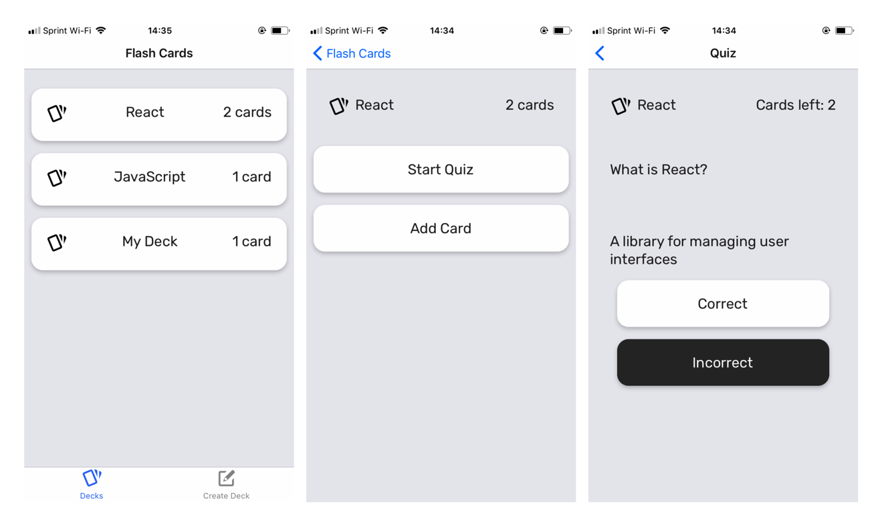
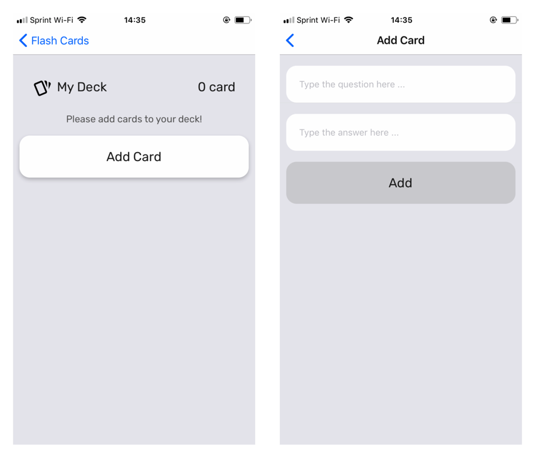

### Getting Started

This project is built for iOS.

```
git clone https://github.com/JLee21/React-Native-Flash-Cards.git
cd React-Native-Flash-Cards
yarn install
yarn ios
```


### Project Requirements
Use create-react-native-app to build your project.
Allow users to create a deck which can hold an unlimited number of cards.
Allow users to add a card to a specific deck.
The front of the card should display the question.
The back of the card should display the answer.
Users should be able to quiz themselves on a specific deck and receive a score once they're done.
Users should receive a notification to remind themselves to study if they haven't already for that day.

### Views
https://classroom.udacity.com/nanodegrees/nd019/parts/580105de-1f39-4975-866d-4f430f1aef1d/modules/1688bcd3-4384-4d37-8564-39d16da178b4/lessons/18fb0b90-21c7-42bf-a719-f16f804c1e25/concepts/4a0c5448-4b5d-4f30-8db3-e7aaf0295701\

Deck List View (Default View)
  displays the title of each Deck
  displays the number of cards in each deck

Individual Deck View
  displays the title of the Deck
  displays the number of cards in the deck
  displays an option to start a quiz on this specific deck
  An option to add a new question to the deck

Quiz View
  displays a card question
  an option to view the answer (flips the card)
  a "Correct" button
  an "Incorrect" button
  the number of cards left in the quiz
  Displays the percentage correct once the quiz is complete

New Deck View
  An option to enter in the title for the new deck
  An option to submit the new deck title

New Question View
  An option to enter in the question
  An option to enter in the answer
  An option to submit the new question

### Data Model

We'll use AsyncStorage to store our decks and flashcards. Redux is optional for this project.

Using AsyncStorage you'll manage an object whose shape is similar to this:

{
  React: {
    title: 'React',
    questions: [
      {
        question: 'What is React?',
        answer: 'A library for managing user interfaces'
      },
      {
        question: 'Where do you make Ajax requests in React?',
        answer: 'The componentDidMount lifecycle event'
      }
    ]
  },
  JavaScript: {
    title: 'JavaScript',
    questions: [
      {
        question: 'What is a closure?',
        answer: 'The combination of a function and the lexical environment within which that function was declared.'
      }
    ]
  }
}

### API

To manage your AsyncStorage database, you'll want to create four different helper methods.

`getDecks`: return all of the decks along with their titles, questions, and answers.
`getDeck`: take in a single id argument and return the deck associated with that id.
`saveDeckTitle`: take in a single title argument and add it to the decks.
`addCardToDeck`: take in two arguments, title and card, and will add the card to the list of questions for the deck with the associated title.
